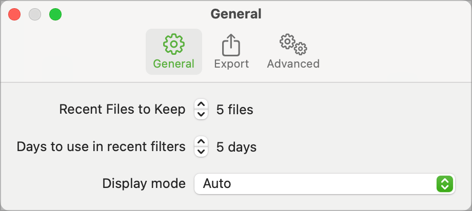

When I started trying to write a Mac app for the first time, I started out knowing what I wanted to achieve but not knowing how to go about it. I spent a lot of time googling for Mac development help and found very little of it. What i did find was mostly related to Objective-C and not Swift/SwiftUI.

So, I spent a lot of time going round in circles, extracting the bits that I thought relevant and heading down a lot of blind alleys.

This project is part of a seried of development notes I want to write to document some of the stuff I learnt along the way. The note that goes with it can be found on my web site.

 [Settings View Article](http://www.sabarnett.co.uk/blogPage.php?id=settingsWindow)

All but the most basic of apps will need some kind of customisation, provided via settings. There is a simple mechanism for displaying a settings window but the content of that window and how to format that content is entirely up to the developer. This note walks through creating a three tab settings screen.

